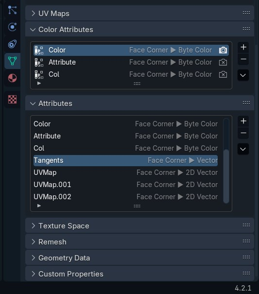
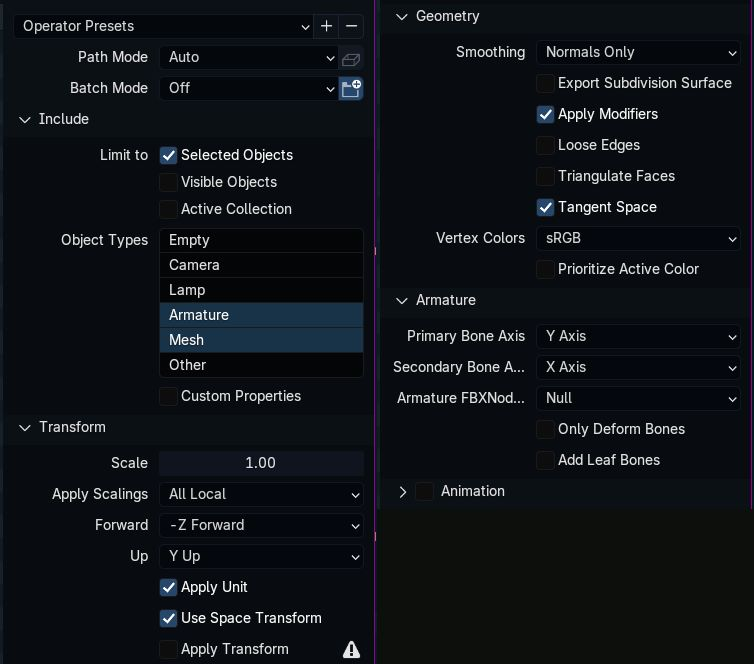
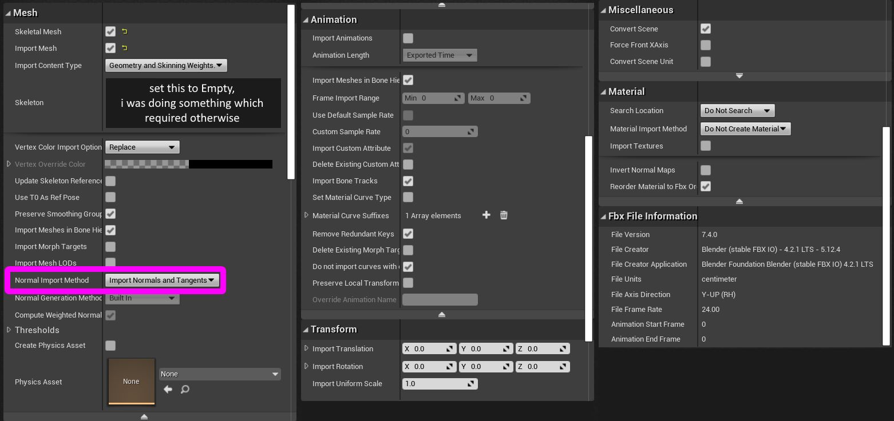

# Setting up tangent-based outlines
*This section is under construction, and was written by @muuyo*

 

Due to the use of the newer advanced project, the switch to a different outline generation method different than the one most modders are used to is necessary.
The difference is pretty minimal, essentially requiring you to press one extra button before exporting to Blender.
However, it might be a bit confusing at first, thus this guide exists.

**You will require a copy of the plugin [Abnormal](https://github.com/bnpr/Abnormal/releases) and the improved FBX plugin [here](./io_scene_fbx_arcsys.zip) to do this.**
To install it, simply go to the link above, download the latest release, and add it as a blender addon in Preferences (Addons → top-right arrow → Install from File). Do the same for the FBX exporter, and disable Blender's built-in one.

I believe you also need to be running Blender 4.2.

To begin:

- Set up a model for exporting as usual
- Make sure it has an attribute with the name `Tangents` and the type `Face Corner -> Vector`. To do this, go into the menu shown below. If there's already anything named Tangents that *isn't* that (or there are multiple), remove all of them using the - (in both the Color Attribute and Attribute tabs); then, hit the + in the Attributes section and put in `Tangents` with domain Face Corner and type Vector.

- You will see a button on the right side (or top) of your Blender 3D Viewport (if Abnormal is enabled) labeled "BNPR Abnormal". If there's no sidebar, hit N. Enter "BNPR Abnormal" with your model selected, select `Tangents` for the `Face Corner Attribute:` field (with nothing selected in the Vertex Group), and finally hit `Normals --> Face Corner Attribute`.

You're done setting up the model itself! Note that you'll have to press `Normals --> Face Corner Attribute` again if any changes to the model are made (though if you're just testing, it's fine).

# Exporting

Now, to export:
- Open the Export as FBX menu and *make sure it says "Export FBX (Arc System Works)"* on the confirm button
- Put in these exact settings (the one that differs from standard exporting is "Tangent Space")

For ease of use, I recommend hitting the plus at the top right and adding a preset (named anything). You can select these presets on subsequent launches by using the dropdown.
Afterwards, export to FBX as standard (using the filename that the game's model originally had)

# Importing

To import into Unreal, the process is largely the same as before except with one different setting, as shown below.

Remember to set the Outline LOD indexes as usual.

# Verifying this all worked

You should finally be done! It's a lot faster when doing it a second time.
To verify everything worked, you'll have to make a very simple custom material. Follow the video below, and if both results look the same, **it worked.** If they don't, something messed up somewhere. Feel free to delete the material afterwards.

<video controls width=80%>
  <source src="./images/materialchecking.mp4" type="video/mp4" />

</video>